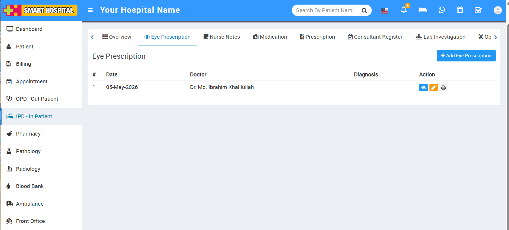
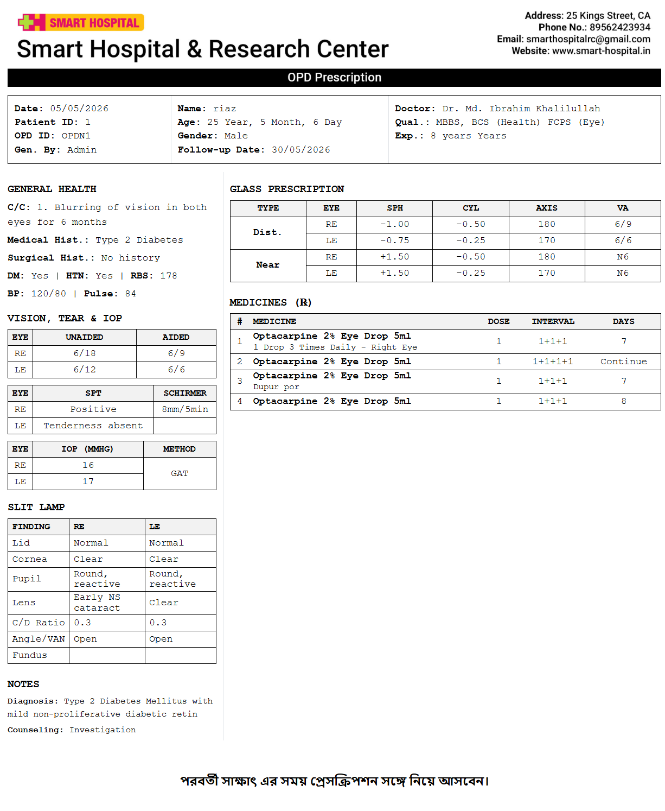

# Smart Hospital - Ophthalmology (Eye Prescription) Module

An advanced **Ophthalmology & Eye Prescription Module** built as a custom extension for the [**Smart Hospital Management  - Version 6.0**](https://codecanyon.net/item/smart-hospital-hospital-management-system/23205038) (CodeIgniter 3). This module allows doctors and hospital staff to manage eye prescriptions, vision tests, and ophthalmic records efficiently, with a seamless experience for patients to view and print their records directly from the patient portal.

## 🌟 Key Features

### For Doctors & Admins
* **Comprehensive Eye Examination:** Record Unaided/Aided Vision, Cornea, Pupil, Lens, Fundus, and IOP measurements.
* **Refraction Data:** Dedicated support for Distance and Near vision (Spherical, Cylindrical, Axis, VA) for both Left & Right eyes.
* **Clinical History:** Capture Chief Complaints (C/C), Medical History, and Surgical History.
* **General Vitals:** Integrated fields for Diabetes (DM), Hypertension (HTN), RBS, Blood Pressure, and Pulse.
* **Dynamic Prescription Printing:** Automatically formats the prescription based on the visit context (OPD or IPD) and prints with the hospital's dynamic header/footer. Empty fields are intelligently hidden from the print view.
* **Data Transparency:** The printed prescription explicitly shows the "Generated By" field, ensuring accountability for the staff member who created the record.

### For Patients (Patient Portal)
* **Seamless Integration:** "Eye Prescription" tab elegantly integrated into both OPD and IPD patient profiles.
* **Read-only Viewing:** Secure AJAX-based modal to view the full prescription details, medication list, and optical data without page reloads.
* **Self-Service Printing:** Patients can securely print their ophthalmic prescriptions from home. Authentication layers ensure patients can only access their own records.

---

## 🛠 Tech Stack
* **Framework:** CodeIgniter 3.x
* **Language:** PHP 7.4+
* **Database:** MySQL / MariaDB
* **Frontend:** HTML5, Bootstrap 3, jQuery, AJAX

---

## 📂 Project Structure

```text
├── application/
│   ├── controllers/
│   │   ├── admin/Eyeprescription.php       # Admin & Doctor Controller
│   │   └── patient/Eyeprescription.php     # Patient Portal Controller
│   ├── models/
│   │   └── Eyeprescription_model.php       # DB Logic, Joins, & Queries
│   └── views/
│       ├── admin/
│       │   └── eyeprescription/            # Add, Edit, View, Print & Tab views
│       ├── patient/
│       │   └── eyeprescription/            # Modal & Script views for Patient Portal
│       └── patient/
│           ├── ipdProfile.php              # Injected IPD Tab
│           └── visitDetails.php            # Injected OPD Tab
```

---

## 🚀 Installation & Migration Guide

To install this module on a live server, follow these steps:

### 1. Database Setup
Run the `eye_prescription_migration.sql` file in your MySQL database. This creates three primary tables:
* `eye_prescriptions`: Core prescription metadata and optical examination findings.
* `eye_prescription_refractions`: Multi-row tracking for Distance/Near glasses data.
* `eye_prescription_medicines`: Pharmaceutical records tied to the specific prescription.

### 2. Copy Module Files
Upload the core MVC files into your existing CodeIgniter structure:
* `admin/Eyeprescription.php` -> `controllers/admin/`
* `patient/Eyeprescription.php` -> `controllers/patient/`
* `Eyeprescription_model.php` -> `models/`
* `views/admin/eyeprescription/` -> `views/admin/`
* `views/patient/eyeprescription/` -> `views/patient/`

### 3. Apply UI Injections
To display the tabs in the UI, you must overwrite/update the following files in your live environment to include the "Eye Prescription" tab triggers and AJAX loaders:
* `application/controllers/patient/Dashboard.php`
* `application/views/admin/patient/ipdprofile.php`
* `application/views/admin/patient/visitDetails.php`
* `application/views/patient/ipdProfile.php`
* `application/views/patient/visitDetails.php`

---

## 📸 Screenshots

| Admin Dashboard (Add Prescription) | 
| :---: | 
|   | 

| Printed Prescription (Dynamic) |
| :---: |
|  |

---

## 🔒 Security Measures
* **Ownership Checks:** Patient Portal controllers strictly verify that `$patient_id == Session_UserID` before loading views or fetching print templates.
* **Role-Based Access Control (RBAC):** Integrated tightly into Smart Hospital's native RBAC library so administrators can restrict module access per staff role.
